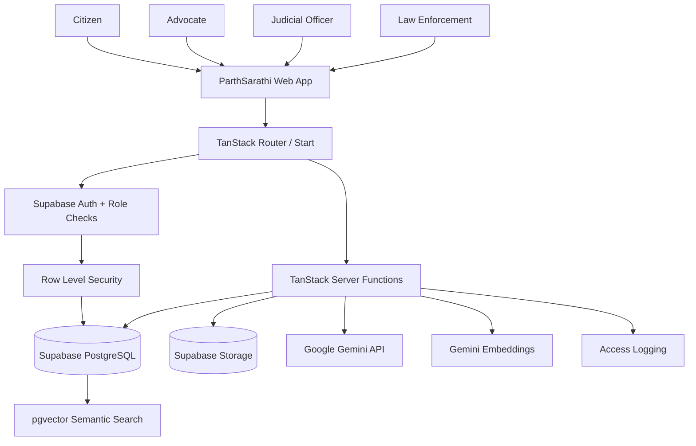
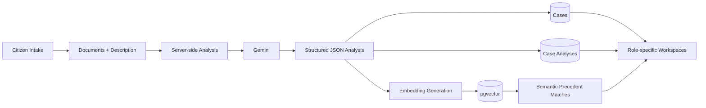

<div align="center">

# ⚖️ ParthSarathi

### A secure, AI-assisted bridge between citizens and the Indian justice system.

**ParthSarathi** is a full-stack legal-access platform that helps citizens structure a legal matter, understand case information, connect with advocates, and securely interact with role-specific justice workflows.

It combines **AI-assisted document analysis, role-based access control, secure case storage, advocate discovery, judicial case intelligence, law-enforcement lookup, and semantic precedent search** in one application.

<br />

[](https://react.dev/)
[](https://www.typescriptlang.org/)
[](https://tanstack.com/start)
[](https://vite.dev/)
[](https://supabase.com/)
[](https://ai.google.dev/)
[](https://github.com/pgvector/pgvector)
[](https://eslint.org/)


<br />


</div>

---

## 📌 Table of Contents

- [About ParthSarathi](#-about-parthsarathi)
- [Why ParthSarathi](#-why-parthsarathi)
- [Core Features](#-core-features)
- [User Roles](#-user-roles)
- [How It Works](#-how-it-works)
- [AI & Legal Intelligence](#-ai--legal-intelligence)
- [Architecture](#-architecture)
- [Technology Stack](#-technology-stack)
- [Project Structure](#-project-structure)
- [Getting Started](#-getting-started)
- [Environment Variables](#-environment-variables)
- [Supabase Setup](#-supabase-setup)
- [Running the Project](#-running-the-project)
- [Server Functions / API Surface](#-server-functions--api-surface)
- [Database & Security Model](#-database--security-model)
- [Development Commands](#-development-commands)
- [Deployment](#-deployment)
- [Important Notes & Limitations](#-important-notes--limitations)
- [Contributing](#-contributing)
- [License](#-license)

---

## 🏛️ About ParthSarathi

Legal processes can be difficult to navigate because information is often spread across documents, filings, hearing records, and different professional workflows.

ParthSarathi is designed as a **digital access layer around the justice process**. Instead of treating AI as a replacement for legal professionals, the platform uses AI to help convert unstructured information into a clearer, traceable case record that humans can review.

### The platform is designed around four principles

| Principle | What ParthSarathi does |
|---|---|
| **Clarity** | Turns a citizen's description and submitted documents into structured case information. |
| **Traceability** | AI-generated analysis includes source fields and the interface exposes document/record traceability. |
| **Access** | Helps citizens discover available advocates based on practice areas and profile information. |
| **Controlled access** | Role-aware routing, authentication, database policies, protected documents, and audit logging restrict sensitive workflows. |

> **Important:** ParthSarathi provides **AI assistance**, not a legal judgment, legal representation, or a substitute for a qualified advocate or judicial decision-maker.

---

## 🎯 Why ParthSarathi

### The problem

A person approaching the justice system may have:

- Scanned documents or PDFs without a clear summary.
- Difficulty identifying the relevant legal category.
- Important dates and facts buried inside long documents.
- Limited understanding of what information matters.
- Difficulty finding a suitable advocate.
- Multiple communication and case-tracking steps spread across different channels.

### The approach

ParthSarathi connects these stages into a single workflow:

```text
Citizen / Authorized User
        │
        ▼
Secure Authentication
        │
        ▼
Case Intake + Documents
        │
        ▼
Structured Case Record
        │
        ▼
AI-Assisted Analysis
        │
        ├──────────────► Case Summary
        ├──────────────► Extracted Facts
        ├──────────────► Key Dates
        ├──────────────► Category
        ├──────────────► Urgency
        ├──────────────► Legal Insights
        └──────────────► Similar Cases / Precedents
        │
        ▼
Human Review + Role-Specific Workflow
        │
        ├──────────────► Citizen
        ├──────────────► Advocate
        ├──────────────► Judicial Officer
        └──────────────► Law Enforcement
```

---

## ✨ Core Features

### 👤 Citizen Portal

Citizens can:

- Create and track legal matters.
- Describe what happened in plain language.
- Upload PDFs and images as case documents.
- Follow the case-processing pipeline.
- Review the generated case summary and extracted information.
- See urgency and category information.
- View documents, analysis, advocates, messages, and notifications.
- Discover available advocates.
- Send an engagement request to an advocate.
- Message an advocate within the relevant case context.
- Use the AI assistant to ask questions about their matter.
- Manage profile and contact information.

### 📄 AI-Assisted Case Intake

The intake workflow accepts a matter description and supporting documents, then produces a structured analysis containing:

- Suggested case title.
- Legal category.
- Urgency level.
- Reason for urgency.
- Parties.
- Extracted facts with confidence values.
- Key dates and events.
- Legal insights.
- Similar cases.
- Precedent references.
- Recommended advocate specializations.
- Suggested court.

The UI presents the work as a staged processing pipeline:

```text
Secure Upload
     ↓
OCR / Text Recognition
     ↓
Fact Extraction
     ↓
AI Analysis
     ↓
Categorisation
     ↓
Urgency Classification
     ↓
Plain-Language Case Summary
```

The current implementation can pass supported PDFs/images directly to the Gemini analysis flow and can also work with text supplied by the intake layer.

### ⚖️ Advocate Discovery & Engagement

Citizens can browse advocate profiles containing information such as:

- Practice areas / specializations.
- Years of experience.
- Number of cases handled.
- Profile summary.
- Court and city.
- Languages.
- Consultation fee.
- Availability.
- Rating.
- Bar Council identifier.

Citizens can then send a case-specific request. Advocates can **accept or reject** requests. On acceptance, the case becomes assigned and case messaging becomes available.

### 🧑‍⚖️ Advocate Workspace

Advocates get a separate workspace for:

- Intake queue.
- Direct citizen requests.
- Accepted / active matters.
- Case analysis.
- Original case documents.
- Extracted facts and legal insights.
- Precedent information.
- Client messaging.
- Availability control.
- Professional profile management.

### 🏛️ Judicial Workspace

The judicial workflow includes:

- Case docket.
- Cause list / hearing information.
- Case details.
- Chronological timeline.
- Missing-information indicators.
- Similar-precedent discovery.
- Precedent lookup.
- Judicial AI assistant.
- Audit logging for sensitive access.

### 🚔 Law-Enforcement Workspace

Authorized law-enforcement users have a constrained lookup workflow for:

- Case status.
- Hearing information.
- Search by case number.
- Search by filing number.
- Search by title / party-related terms.

The interface explicitly keeps sensitive filings restricted in the law-enforcement workflow.

### 💬 Case-Specific Messaging

Messages are attached to a case context and support:

- Citizen ↔ advocate communication.
- Sender identity and role.
- Timestamped conversation history.
- Optional document attachment metadata.

### 🔔 Notifications

The application maintains per-user notifications for events such as:

- Case analysis completion.
- Advocate engagement requests.
- Workflow updates.

Unread notifications can be marked as read from the application shell.

### 🔎 Semantic Precedent Search

The project uses **768-dimensional embeddings** and PostgreSQL **pgvector** to support semantic matching.

The flow is:

```text
Case Analysis
     │
     ▼
Text Representation
     │
     ▼
Gemini Embedding API
     │
     ▼
768-D Vector
     │
     ▼
Supabase / pgvector
     │
     ▼
Cosine-Similarity Matching
     │
     ▼
Relevant Precedents
```

This is implemented through a Supabase RPC that performs vector matching against stored precedent embeddings.

### 🔐 Access Control & Auditability

The project includes:

- Supabase authentication.
- Role-aware route protection.
- Role-specific navigation.
- Row Level Security (RLS) policies.
- Case-level access checks.
- Protected document storage.
- Short-lived signed document download URLs.
- Lawyer verification workflow.
- Sensitive access logging.
- Server-only service-role access.
- CSRF protection for server functions.

---

## 👥 User Roles

ParthSarathi defines four application roles:

| Role | Main capabilities |
|---|---|
| **Citizen** | File matters, upload documents, view case analysis, find advocates, request representation, message advocates, use the assistant, manage profile. |
| **Advocate / Lawyer** | Review intake queue, receive requests, accept/reject matters, access assigned case information, communicate with clients, manage availability/profile. |
| **Judicial Officer** | Access the judicial workspace, review docket/hearings, inspect case records, view semantic precedent matches, use judicial assistance, log sensitive access. |
| **Law Enforcement** | Perform authorized case-status and hearing lookups through a restricted records workflow. |

Role-to-home routing is explicitly modeled in the application:

```text
citizen        → /citizen
lawyer         → /lawyer
judge          → /judicial
law_enforcement→ /enforcement
```

---

## 🔄 How It Works

### 1. Citizen creates a matter

The citizen enters a description and can choose an optional legal category and court.

### 2. Documents are attached

The intake layer supports document metadata, PDFs, and images. Documents can be stored in the `case-documents` Supabase storage bucket.

### 3. AI analysis runs server-side

The application sends the case context to the server-side AI layer. The server is responsible for reading the Gemini API key; the browser does not need to hold the Gemini secret.

### 4. The result becomes a structured case record

The analysis is converted into application data containing facts, dates, parties, legal insights, similar cases, precedents, urgency, and recommended practice areas.

### 5. Case data is persisted

When Supabase is available, the application stores the case, documents, analysis, notifications, and case embeddings in the database.

The application persists live case-analysis results through the configured Supabase and Gemini services.

### 6. Human-facing workflows continue

The citizen can discover advocates, request engagement, and communicate within the case. Advocates, judicial officers, and law-enforcement users see different role-specific workflows.

---

## 🧠 AI & Legal Intelligence

### Gemini-powered analysis

The server-side AI layer uses Google Gemini through the Generative Language API.

The configured chat model defaults to:

```text
gemini-3.5-flash
```

The implementation also has fallback model candidates for temporary provider failures.

### Grounding approach

The analysis prompt is explicitly designed to:

- Work from supplied case material.
- Identify the document/location used for extracted information.
- Mark inferred values as inferred.
- Return structured JSON.
- Provide confidence and similarity values between `0` and `1`.
- Avoid issuing a final legal judgment.

The assistant also receives the selected case context and is instructed to say when information is missing instead of inventing it.

### Embeddings

Semantic search uses:

```text
gemini-embedding-001
```

with a target dimensionality of:

```text
768
```

Embeddings are stored in PostgreSQL using `pgvector` and searched with cosine similarity.

> **Safety note:** Grounding and traceability reduce unsupported output, but no generative AI system should be treated as infallible. All AI-generated information remains assistive.

---

## 🏗️ Architecture

### High-level architecture



### Case-analysis architecture



### Security boundary

```text
Browser
  │
  ├── Supabase publishable/client credentials
  │
  └── Authenticated Server Functions
            │
            ├── user-scoped Supabase client → RLS-protected data
            │
            ├── server-only admin client → trusted operations only
            │
            ├── Gemini API → server-side secret
            │
            └── signed document URLs → time-limited access
```

---

## 🧰 Technology Stack

| Layer | Technology | Purpose |
|---|---|---|
| UI | React 19 | Component-based interface |
| Language | TypeScript | Type-safe application code |
| Full-stack framework | TanStack Start | SSR/full-stack routing and server functions |
| Routing | TanStack Router | File-based routing and role-specific routes |
| Build | Vite 8 | Development and production bundling |
| Styling | Tailwind CSS 4 | Utility-first styling |
| UI primitives | Radix UI / shadcn-style components | Accessible reusable UI |
| Icons | Lucide React | Consistent iconography |
| Animation | Framer Motion + GSAP + Lenis | Purposeful UI motion and scrolling effects |
| 3D | Three.js + React Three Fiber | Landing experience / justice-themed 3D visuals |
| Data fetching | TanStack Query | Client-side server-function data management |
| Validation | Zod | Server-function input validation |
| Backend | Supabase | Auth, PostgreSQL, storage, RPC |
| Database search | pgvector | Semantic vector similarity |
| AI | Google Gemini | Case analysis, assistant, embeddings |
| Email | Resend (optional) | Advocate-code transactional email |
| Linting | ESLint | Code quality |
| Formatting | Prettier | Consistent formatting |
| Deployment output | Nitro / TanStack Start | Production server build |

---

## 📁 Project Structure

```text
parthsarathi/
├── public/
│   ├── favicon.ico
│   └── robots.txt
│
├── src/
│   ├── assets/
│   │   ├── consultation.jpg
│   │   ├── documents.jpg
│   │   └── hero-court.jpg
│   │
│   ├── components/
│   │   ├── app-shell.tsx
│   │   ├── brand.tsx
│   │   ├── case-detail.tsx
│   │   ├── floating-assistant.tsx
│   │   ├── landing-experience.tsx
│   │   ├── landing-motion.tsx
│   │   ├── hero-3d.tsx
│   │   ├── story-3d.tsx
│   │   ├── three/
│   │   └── ui/
│   │
│   ├── hooks/
│   │   ├── use-me.ts
│   │   └── use-mobile.tsx
│   │
│   ├── integrations/
│   │   ├── lovable/
│   │   └── supabase/
│   │
│   ├── lib/
│   │   ├── account.functions.ts
│   │   ├── advocate-database.ts
│   │   ├── ai.server.ts
│   │   ├── cases.functions.ts
│   │   ├── demo-analysis.server.ts
│   │   ├── email.server.ts
│   │   ├── nav.ts
│   │   ├── nyaysetu.ts
│   │   ├── types.ts
│   │   ├── verification.functions.ts
│   │   └── workspace.functions.ts
│   │
│   ├── routes/
│   │   ├── auth.tsx
│   │   ├── index.tsx
│   │   ├── reset-password.tsx
│   │   ├── gateway.tsx
│   │   └── _authenticated/
│   │       ├── citizen/
│   │       ├── lawyer/
│   │       ├── judicial/
│   │       ├── enforcement/
│   │       ├── admin.verifications.tsx
│   │       └── register.tsx
│   │
│   ├── router.tsx
│   ├── server.ts
│   ├── start.ts
│   └── styles.css
│
├── supabase/
│   ├── config.toml
│   └── migrations/
│
├── .env.example
├── .gitignore
├── package.json
├── package-lock.json
├── tsconfig.json
├── vite.config.ts
└── README.md
```

### Important implementation files

| File | Responsibility |
|---|---|
| `src/lib/ai.server.ts` | Gemini chat, structured analysis, assistant responses, embeddings |
| `src/lib/cases.functions.ts` | Case creation, analysis persistence, documents, lawyers, messages, notifications |
| `src/lib/workspace.functions.ts` | Advocate queue, judicial docket, hearings, precedents, enforcement search, audit logging |
| `src/lib/verification.functions.ts` | Advocate verification application and review flow |
| `src/lib/account.functions.ts` | Account/profile/role operations |
| `src/integrations/supabase/auth-middleware.ts` | Server-side authentication context |
| `src/integrations/supabase/client.server.ts` | Server-only Supabase service-role client |
| `src/integrations/supabase/client.ts` | Browser/SSR Supabase client |
| `src/start.ts` | TanStack Start middleware, Supabase auth attachment, CSRF protection |
| `supabase/migrations/` | Database schema, RLS policies, storage policies, verification flow, judicial module, vector search |

> Some internal source files and historical/generated assets still contain older **NyaySetu / Nyaya Gateway** naming. The product-facing project name is **ParthSarathi**.

---

## 🚀 Installation & Setup

This section takes you from a fresh clone to a working ParthSarathi instance with **Supabase + Gemini** configured.

### 1. Prerequisites

Install the following before starting:

- **Node.js 22.12+**
- **npm**
- A **Supabase** account/project
- A **Google Gemini API key**
- **Supabase CLI** for applying the included migrations

Check your versions:

```bash
node --version
npm --version
npx supabase --version
```

### 2. Clone the repository

```bash
git clone <your-github-repository-url>
cd <your-repository-name>
```

### 3. Install dependencies

```bash
npm install
```

### 4. Create the environment file

Copy the example environment file:

```bash
cp .env.example .env
```

On Windows PowerShell:

```powershell
Copy-Item .env.example .env
```

Open `.env` and fill in the values described below.

### 5. Create and configure Supabase

Create a new project at **https://supabase.com**.

From your Supabase project dashboard, collect:

- Project URL
- Publishable key
- Service-role key
- Project reference ID

Then configure:

```env
VITE_SUPABASE_URL=https://YOUR_PROJECT_REF.supabase.co
VITE_SUPABASE_PUBLISHABLE_KEY=sb_publishable_YOUR_KEY

SUPABASE_URL=https://YOUR_PROJECT_REF.supabase.co
SUPABASE_PUBLISHABLE_KEY=sb_publishable_YOUR_KEY
SUPABASE_SERVICE_ROLE_KEY=YOUR_SERVER_ONLY_SERVICE_ROLE_KEY
```

### 6. Apply the database migrations

Log in to the Supabase CLI:

```bash
npx supabase login
```

Link the project:

```bash
npx supabase link --project-ref <YOUR_PROJECT_REF>
```

Push the repository migrations:

```bash
npx supabase db push
```

These migrations create the required application tables, functions, RLS policies, storage configuration, verification workflow, judicial workflow, audit structures, and vector-search support.

### 7. Configure Google Gemini

Create a Gemini API key through **Google AI Studio** and add it to `.env`:

```env
GEMINI_API_KEY=your_gemini_api_key_here
GEMINI_MODEL=gemini-3.5-flash
```

ParthSarathi uses Gemini for:

- Structured case analysis.
- Case-aware assistant responses.
- Text embeddings for semantic precedent search.

The Gemini key is used **server-side** and must never be exposed in frontend code.

### 8. Configure optional email support

Advocate verification can use Resend for transactional email.

Add:

```env
RESEND_API_KEY=your_resend_api_key
RESEND_FROM=ParthSarathi <onboarding@resend.dev>
```

This integration is optional. The core application can run without Resend when email delivery is not required.

### 9. Configure scheduled jobs only when needed

The repository contains support for cron-authenticated server jobs.

Only configure these when your deployment actually uses the related scheduled workflow:

```env
LOVABLE_CRON_SECRET=your_cron_secret
LOVABLE_CRON_SECRET_PREVIOUS=previous_cron_secret_if_rotating
```

### 10. Verify your environment

Your `.env` should contain the real values and **must not be committed**.

At minimum, a live setup should contain:

```env
VITE_SUPABASE_URL=
VITE_SUPABASE_PUBLISHABLE_KEY=

SUPABASE_URL=
SUPABASE_PUBLISHABLE_KEY=
SUPABASE_SERVICE_ROLE_KEY=

GEMINI_API_KEY=
GEMINI_MODEL=gemini-3.5-flash
```

### 11. Start ParthSarathi

Run the development server:

```bash
npm run dev
```

Open the local URL printed by Vite/TanStack Start in your browser.

### 12. Verify the main application flow

After the application starts, verify:

```text
Sign in / Register
      ↓
Create a Case
      ↓
Enter Case Description
      ↓
Upload Supporting Documents
      ↓
Run AI Analysis
      ↓
Review Structured Case Analysis
      ↓
Search / Request an Advocate
      ↓
Continue through the relevant Role Workspace
```

For the semantic precedent search to work, the database must contain precedent records with embeddings and the pgvector migration/RPC must be applied successfully.

### 13. Production build

Once the application works locally, create the production build:

```bash
npm run build
```

Then preview the production output locally:

```bash
npm run preview
```

### 14. Production deployment checklist

Before deploying:

```bash
npm run lint
npm run build
```

Then make sure the production environment contains the same required server-side variables:

```text
Supabase URL
Supabase publishable key
Supabase service-role key
Gemini API key
Gemini model
Optional Resend credentials
Optional cron credentials
```

Do **not** copy `.env` into the Git repository or publish it with the application.

### Environment Variables Reference

| Variable | Required | Used for |
|---|---:|---|
| `VITE_SUPABASE_URL` | Yes | Browser/SSR Supabase connection |
| `VITE_SUPABASE_PUBLISHABLE_KEY` | Yes | Browser/SSR Supabase client |
| `SUPABASE_URL` | Yes | Server-side Supabase connection |
| `SUPABASE_PUBLISHABLE_KEY` | Yes | Server-side Supabase client |
| `SUPABASE_SERVICE_ROLE_KEY` | Yes | Trusted server-side database/storage operations |
| `GEMINI_API_KEY` | Yes for live AI | Gemini analysis, assistant, embeddings |
| `GEMINI_MODEL` | Recommended | Gemini chat model selection |
| `RESEND_API_KEY` | Optional | Transactional email |
| `RESEND_FROM` | Optional | Email sender identity |
| `LOVABLE_CRON_SECRET` | Optional | Authenticated scheduled jobs |
| `LOVABLE_CRON_SECRET_PREVIOUS` | Optional | Secret rotation support |

### 🔐 Never commit secrets

Add the local environment file to Git ignore:

```gitignore
.env
.env.*
!.env.example
```

If a secret has already been committed, remove the file from the repository and **rotate the exposed credential immediately**. Removing it from the latest commit alone does not remove it from Git history.

## 🗄️ Supabase Setup

The project includes Supabase migrations for the application's database and security model.

The schema includes tables for concepts such as:

- `profiles`
- `user_roles`
- `lawyer_profiles`
- `cases`
- `case_requests`
- `case_documents`
- `case_analyses`
- `case_messages`
- `hearings`
- `notifications`
- `precedents`
- `access_log`
- `lawyer_verification_requests`
- `case_embeddings`
- Judicial-module tables and related embeddings/audit records

### Storage buckets

The migrations configure protected storage for:

```text
case-documents
lawyer-credentials
```

The application uses server-generated signed URLs for protected document downloads.

### Row Level Security

RLS policies are used to scope access based on the authenticated user and role.

Examples include:

- Citizens can read their own cases.
- Assigned advocates can read cases assigned to them.
- Verified advocates can see the pending intake queue.
- Judicial / law-enforcement roles receive controlled access to their workflows.
- Case documents require case-level access checks.
- Case messages are restricted to the appropriate case participants.
- Lawyer verification records are restricted to the applicant/admin workflow.

---

## ▶️ Running the Project

### Development

```bash
npm run dev
```

### Production build

```bash
npm run build
```

### Development-mode production build

```bash
npm run build:dev
```

### Preview the production build

```bash
npm run preview
```

### Lint

```bash
npm run lint
```

### Format

```bash
npm run format
```

---

## 🧩 Server Functions / API Surface

ParthSarathi does not depend on a large collection of manually maintained REST endpoints. Its backend operations are primarily implemented as **typed TanStack Start server functions** with Zod input validation and Supabase authentication middleware.

### Account & profile

| Function | Purpose |
|---|---|
| `getMe` | Get the authenticated user's application profile, role, verification state, and lawyer profile |
| `completeRegistration` | Complete role/profile registration |
| `updateProfile` | Update user profile information |
| `updateLawyerProfile` | Update advocate professional information |
| `checkPhoneUnique` | Check profile phone uniqueness |

### Case & citizen workflow

| Function | Purpose |
|---|---|
| `listMyCases` | List the signed-in citizen's matters |
| `getCaseBundle` | Fetch case + documents + analysis + requests + messages |
| `createCaseWithAnalysis` | Create a case, upload documents, run AI analysis, persist results and embeddings |
| `listLawyers` | List available advocate profiles |
| `requestLawyer` | Send an advocate engagement request |
| `withdrawRequest` | Withdraw a citizen's pending request |
| `sendCaseMessage` | Send a case-scoped message |
| `listNotifications` | Retrieve user notifications |
| `markNotificationsRead` | Mark notifications as read |
| `askCaseAssistant` | Case-aware assistant for citizen/lawyer/judge audiences |
| `getDocumentDownloadUrl` | Generate a short-lived secure document URL |

### Advocate workflow

| Function | Purpose |
|---|---|
| `lawyerQueue` | Retrieve pending matters awaiting an advocate |
| `lawyerCases` | Retrieve matters assigned to the signed-in advocate |
| `lawyerRequests` | Retrieve direct citizen requests |
| `respondToCase` | Accept/reject an engagement request |

### Verification workflow

| Function | Purpose |
|---|---|
| `submitLawyerApplication` | Submit Bar Council / advocate verification information |
| `myLawyerApplication` | Retrieve the current advocate application |
| `listLawyerApplications` | Admin review queue |
| `reviewLawyerApplication` | Approve/reject an advocate application |
| `resolveAdvocateAccount` | Resolve an Advocate Code to the associated account |

### Judicial & records workflow

| Function | Purpose |
|---|---|
| `judicialDocket` | Retrieve judicial case docket |
| `listHearings` | Retrieve hearing records by date range |
| `listPrecedents` | Search stored precedents |
| `findSimilarPrecedents` | Semantic precedent matching through pgvector |
| `logAccess` | Record sensitive access / audit events |
| `enforcementSearch` | Restricted case and hearing lookup for authorized law-enforcement users |
| `getJudicialCaseBundle` | Retrieve the judicial case bundle |

---

## 🔐 Database & Security Model

### Authentication

Authentication is handled through Supabase Auth. The client attaches the authenticated access token to server-function calls.

### Role enforcement

Application roles are represented as:

```text
citizen
lawyer
judge
law_enforcement
```

The database also exposes helper functions used by authorization policies, including role and verified-role checks.

### Case access

Case access is not based on UI hiding alone. The database applies RLS policies so access is constrained at the data layer.

### Document security

Protected case files are stored in a private storage bucket.

The application:

1. Authenticates the user.
2. Verifies document access through the application/database layer.
3. Uses the server-side service-role client only for trusted storage operations.
4. Generates a short-lived signed URL for downloads.

### Audit logging

Sensitive actions can be written to `access_log`, and the judicial module includes additional audit-log support.

### CSRF protection

`src/start.ts` installs CSRF protection for TanStack server-function requests.

---

## 🧪 Development & Quality Checks

Before opening a pull request, run:

```bash
npm run lint
npm run build
```

For formatting:

```bash
npm run format
```

Recommended manual checks:

- Test each role's navigation.
- Verify restricted routes cannot be reached through direct URL entry.
- Test document upload and secure download.
- Test case creation with and without documents.
- Test Gemini-enabled and fallback AI flows.
- Test advocate request → accept/reject lifecycle.
- Test citizen ↔ advocate messaging.
- Test judicial precedent matching.
- Test law-enforcement search.
- Verify `.env` is not tracked.

---

## 🌐 Deployment

The project is configured around **TanStack Start + Vite + Nitro** and is compatible with server-oriented deployments supported by the generated build configuration.

A generic production flow is:

```bash
npm ci
npm run build
```

Then deploy the generated server application using the hosting provider's TanStack Start / Nitro-compatible deployment process.

### Lovable

The project was originally developed with [Lovable](https://lovable.dev), and the repository includes Lovable integration files.

Live application:

**https://nyaya-gateway.lovable.app**

When using the Lovable-connected Git workflow, avoid rewriting published Git history because commits can be synchronized back to the Lovable project.

---

## ⚠️ Important Notes & Limitations

### AI is assistive

ParthSarathi intentionally labels AI output as assistance. It must not be presented as:

- A court judgment.
- Final legal advice.
- A substitute for an advocate.
- A guarantee of case outcome.
- An official court record.

### Source traceability is a design goal, not an absolute guarantee

The AI prompt asks the model to identify source documents/locations and distinguish inference from stated facts. This improves traceability, but generated output still requires human verification.

### External services are optional in some flows

Live Gemini functionality requires a valid `GEMINI_API_KEY`.

Live AI analysis and the case assistant require a valid Gemini API key.

### No dedicated license file was found

The repository currently does not include a `LICENSE` file in its tracked project tree.

Before distributing the code as an open-source project, add an explicit license that matches your team's ownership and intended usage.

### Legacy naming

Some internal files, comments, generated build assets, and historical metadata still refer to **NyaySetu** or **Nyaya Gateway**. This README uses the final product name:

> **ParthSarathi**

---

## 🤝 Contributing

Contributions are welcome.

A useful contribution workflow is:

```bash
git checkout -b feature/your-feature
npm install
npm run lint
npm run build
```

Then make focused changes, verify role/security behavior, and open a pull request describing:

- What changed.
- Why it changed.
- Which user role(s) are affected.
- Whether database migrations are required.
- Whether environment variables changed.
- How the change was tested.

For database changes, add a new Supabase migration rather than editing historical migrations that may already be applied elsewhere.

---

## 📜 License

No license file is currently included in the repository.

Add a `LICENSE` file before publishing the project for external reuse or redistribution.

---

## 🙌 Acknowledgements

ParthSarathi brings together open-source and hosted technologies including:

- React
- TypeScript
- TanStack Start / Router
- Vite
- Tailwind CSS
- Radix UI
- Lucide
- Three.js / React Three Fiber
- Supabase
- PostgreSQL / pgvector
- Google Gemini
- Resend
- Lovable

---

<div align="center">

### ⚖️ ParthSarathi

**Technology should make justice easier to navigate — without replacing the humans responsible for justice.**

</div>
